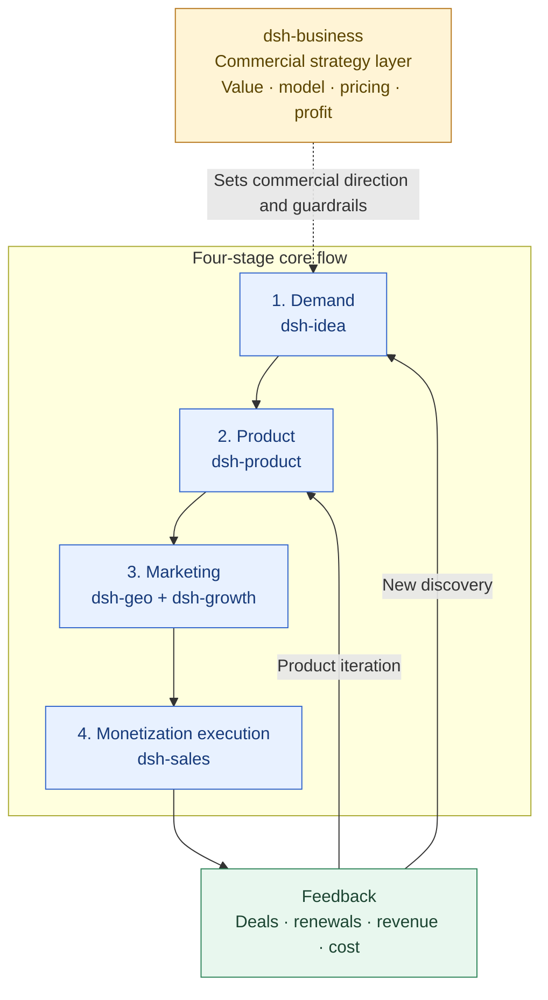

# Generative Engine Optimization

> English | [中文](./README.zh.md)

`dsh-geo` 是“生成式引擎优化” DeepSeek Harness Bundle，为 Markdown 知识库提供可解释的 SEO、GEO 和 AEO 工具。

`dsh-geo` is a DeepSeek Harness bundle that gives the agent explainable SEO, GEO and AEO tools for Markdown knowledge bases.

Public six-plugin collaboration contract: [SUITE.md](https://github.com/winyh/dsh-business/blob/main/SUITE.md).

> Technical package ID: `dsh-geo` · DeepSeek Harness plugin for SEO, GEO and AEO

## Plugin Positioning and Collaboration Navigation

`dsh-geo` is the content-discoverability layer in the six-plugin system. It turns product, commercial and user language into content that search engines and AI answer engines can understand, trust and cite, with traceable evidence for reviewing impact.

- **Owns:** SEO/GEO/AEO audits, keyword and intent maps, content briefs, Markdown content production/review, provenance and freshness, site discoverability, product-discovery preflight and impact reviews.
- **Inputs:** User problems and external language from [dsh-idea](../dsh-idea/README.md), product facts from [dsh-product](../dsh-product/README.md), audience/value/conversion goals from [dsh-business](../dsh-business/README.md), and query, CTR, referral and conversion snapshots from [dsh-growth](../dsh-growth/README.md).
- **Outputs:** SEO/GEO/AEO audits, keyword opportunities, content briefs, previewable Markdown changes, manual distribution packs and impact reviews for growth and opportunity discovery.
- **Does not own:** Ranking or traffic guarantees, Search Console, PageSpeed, paid keyword tools, full crawling or website engineering. It does not log in, submit forms or mass-post.

## Positioning Architecture: Commercial Strategy Layer + Four-Stage Core Flow

The six plugins work together to turn a real demand signal into a deliverable product, reach target customers through marketing, and use monetization results to drive product iteration or discover new opportunities.



This plugin owns content and discoverability in the marketing stage: it turns “what users are looking for, what the product can prove and why it should be trusted” into publishable, reviewable content assets. [dsh-business](../dsh-business/README.md) supplies value, audience and commercial boundaries; [dsh-growth](../dsh-growth/README.md) measures acquisition impact. Customer problems and content gaps found during monetization feed back to [dsh-product](../dsh-product/README.md) and [dsh-idea](../dsh-idea/README.md).

## Plugin Navigation

| Plugin | Clear responsibility | Direct link |
| --- | --- | --- |
| dsh-idea | External opportunities, demand signals, candidate directions and smallest useful tests | [README](../dsh-idea/README.md) |
| dsh-product | Product definition, POC/MVP, release gates and PMF | [README](../dsh-product/README.md) |
| dsh-business | Cross-cutting commercial strategy, value, pricing and profitability | [README](../dsh-business/README.md) |
| dsh-sales | Monetization execution: qualification, deal progression, closing, expansion and renewal | [README](../dsh-sales/README.md) |
| dsh-growth | Acquisition, activation, retention, revenue analysis and growth experiments | [README](../dsh-growth/README.md) |
| dsh-geo | SEO/GEO/AEO, content production and search/answer-engine discoverability (this plugin) | [README](./README.md) |

## Recommended Handoffs

| Output from this plugin | Hand off to | Handoff question |
| --- | --- | --- |
| User queries, content gaps and external competitor signals | [dsh-idea](../dsh-idea/README.md) | Which new problems deserve further opportunity research? |
| Product facts, capability boundaries and user-problem content | [dsh-product](../dsh-product/README.md) | Does the product need better information, experience or evidence? |
| Value propositions, audience, pricing and conversion goals | [dsh-business](../dsh-business/README.md) | Which commercial information belongs in packaging, offers or the business plan? |
| High-intent pages, referrals and conversion snapshots | [dsh-growth](../dsh-growth/README.md) | Which content or channel experiments create measurable growth? |
| Customer objections, sales questions and case-study material | [dsh-sales](../dsh-sales/README.md) | Which content can reduce sales education and closing cost? |

## What it does

- Audit one Markdown note for SEO, GEO and AEO readiness.
- Scan a vault for metadata gaps, missing sources, broken knowledge structure, orphan notes and duplicate titles.
- Check the configured root before scanning and create a shareable project report.
- Build a content brief with query, intent, audience, outline, questions and source gaps.
- Run the complete workflow from a public website URL, public account URL, Markdown export or HTML snapshot.
- Build a qualitative keyword plan from source signals, optional seed terms and Harness web search results; it never invents search volume.
- Turn the diagnosis into a four-stage production plan: diagnose, map keywords, draft, and verify.
- Check source provenance and freshness fields.
- Map the available source to a Google Search Essentials checklist: people-first content, topic language, title/description, crawlable links, HTTPS, canonical/robots signals, structured data, image alt and mobile viewport.
- Use related local knowledge-base titles, headings, entities and queries as a private keyword/content input dimension.
- Preview or apply a complete Markdown replacement, including safe creation of a new note inside `defaultRoot`.
- Incorporate the backlink_skills approach to candidate resources, quality gates, idempotency keys, manual queues and truthful status records; default behavior is read-only preflight and submission preparation, not mass posting.
- Compare manually supplied before/after Search Console, site-analytics or referral snapshots and route the next cycle back to diagnosis.
- Store business goal, audience, market, brand and conversion context locally so each cycle starts from the same project boundary.
- Import keyword opportunities from CSV/JSON/Markdown and map clusters to target pages, including unassigned terms and cannibalization.
- Use `geo_coach` to select the next useful action without introducing approval or role management.
- Review competitor gaps, backlink profile signals, bounded same-origin site audits and manually captured answer-engine citation evidence.

The plugin is local-first. Core analysis runs through the Harness filesystem service. Public URLs use the official anonymous `ctx.web` fetch seam; cookies and credentials are never used. Private or JavaScript-rendered pages should be exported as Markdown/HTML and analyzed as a local snapshot.

## Standard SEO assistance

The built-in standard is based on [Google Search Essentials](https://developers.google.com/search/docs/essentials?hl=zh-cn), the [SEO Starter Guide](https://developers.google.com/search/docs/fundamentals/seo-starter-guide?hl=zh-cn) and the [SEO maintenance guidance](https://developers.google.com/search/docs/fundamentals/get-started?hl=zh-cn). It is an execution checklist, not a ranking guarantee.

For one `geo_workflow` run, the plugin combines four dimensions:

1. **Source evidence:** the page or Markdown note, its intent, facts, headings, links and provenance.
2. **Local knowledge base:** related note titles, headings, entities, primary queries and bounded local excerpts from `defaultRoot`; this stays local.
3. **Keyword signals:** user seed terms, source signals and qualitative public search result titles/snippets when the source is a public URL.
4. **SEO standard:** content, crawl/index, search presentation, links, media and monitoring checks.

The returned `productionPlan.contentInputs` makes these dimensions explicit before drafting. The model can then produce a Markdown draft, and `geo_preview_content`/`geo_apply_content` provide the reviewable writeback path.

The plugin deliberately reports `unknown` when a source cannot prove a deployment-level fact. It does not replace Search Console, PageSpeed, a full public-site crawler or a paid keyword-volume provider. Sitemap coverage, indexing, queries, clicks, Core Web Vitals and server-level robots behavior must be checked with the appropriate external tool after publication.

## User and business pain points

Teams publishing content for both search engines and AI answer engines commonly face these problems:

- Traditional SEO checks focus on keywords and metadata, but do not explain whether an answer engine can understand, trust and cite the content.
- Enterprise knowledge bases accumulate missing sources, stale notes, duplicate titles and orphan pages, making content quality difficult to govern at scale.
- Writers, subject-matter experts and SEO teams use different review standards, so content decisions are slow and hard to reproduce.
- Content optimization is often disconnected from the original Markdown source, creating manual copy-paste work and a risk of overwriting newer edits.
- Teams may not be able to send private product, customer or internal knowledge-base content to an external GEO/SEO service.

This plugin turns those needs into explainable, local-first checks with evidence, scores, priorities and guarded content updates.

## Typical application scenarios

- **Pre-publication review:** Check a new article, product page or technical note for SEO, GEO and AEO readiness before release.
- **Knowledge-base governance:** Scan a team or enterprise Markdown vault to find missing metadata, weak provenance, stale content, orphan notes and duplicate titles.
- **Content planning:** Convert a topic or existing note into a brief with audience, intent, outline, questions and source gaps.
- **Product and technical documentation:** Improve documentation discoverability while preserving source context and review history.
- **Agency and multi-brand operations:** Apply a consistent, auditable review framework across clients, sites or content teams without sharing the source vault with a third-party service.

## Included tools

| Tool | Purpose |
|---|---|
| `geo_setup_check` | Verify root access and scan readiness |
| `geo_audit_note` | Audit one Markdown note |
| `geo_audit_vault` | Scan a knowledge base |
| `geo_project_report` | Create a structured project report |
| `geo_workflow` | Run URL/snapshot diagnosis, Google-standard checks, private knowledge-base keyword planning and content production planning; optionally include a local opportunity map |
| `geo_content_brief` | Generate a structured content brief |
| `geo_source_check` | Check citations and provenance |
| `geo_preview_content` | Preview a complete Markdown replacement |
| `geo_apply_content` | Apply an approved, version-guarded replacement |
| `geo_backlink_plan` | Filter backlink/product-discovery candidates, preflight public routes and prepare a manual submission pack |
| `geo_backlink_record` | Record a user-completed submission, review, publication or ambiguous outcome |
| `geo_backlink_audit` | Summarize campaign records, follow-ups, duplicate keys and data-quality errors |
| `geo_effect_review` | Compare before/after metrics and query/page rows for second-page, low-CTR, indexing and cannibalization opportunities |
| `geo_project_context` | Read or safely write local business, audience, market and brand context |
| `geo_keyword_import` | Import a CSV/JSON/Markdown keyword opportunity file |
| `geo_keyword_opportunities` | Cluster opportunities and detect page-map/cannibalization risks |
| `geo_coach` | Route the project to one useful next action |
| `geo_competitor_gap` | Compare user-supplied competitor topic, keyword and page gaps |
| `geo_backlink_profile` | Review imported broken/lost/nofollow/risky backlink signals |
| `geo_site_audit` | Run a bounded same-origin anonymous HTML audit |
| `geo_prompt_review` | Review manually captured model answers and citation evidence |

## Install from npm

```bash
dsh plugin --profile default add dsh-geo
```

## Install from GitHub

```bash
dsh plugin --profile default add github:winyh/dsh-geo
```

The package builds itself after a GitHub source install. For reproducible deployments, pin the command to a reviewed commit, for example `github:winyh/dsh-geo#<commit>`.

## GitHub discoverability

Publish this directory as a public repository and add the repository topic `dsh-plugin`. The package metadata already includes `dsh-plugin`; the GitHub topic is what makes the repository appear in the Harness plugin topic listing.

## Usage

You do not need to memorize tool names. Describe the goal, source and desired output in natural language; the examples below are copy-and-paste starting points.

### Start here: a five-minute first run

You need only:

1. DeepSeek Harness installed and available as the `dsh` command.
2. One input: a public URL, an exported Markdown/HTML page, or a Markdown knowledge-base root.
3. A goal and audience if you want recommendations tailored to a business outcome.

Follow this first-run sequence:

1. Install the plugin.
2. Set `defaultRoot` in the `dsh-geo` Bundle configuration. It is the only directory the plugin can read or write.
3. Start or restart Harness with `dsh web`.
4. Ask for a readiness check.
5. Save the project boundary with `geo_project_context`.
6. Run `geo_workflow` on one page and keep the first run read-only.

Minimal Bundle configuration:

```yaml
defaultRoot: "<your-knowledge-base-root>"
```

If you do not have a knowledge base yet, use a public URL first. For a private page, export it as Markdown or HTML and put that file under `defaultRoot`; no platform login is needed by this plugin.

### Choose the right entry point

| What you have | Start with | What to ask for |
|---|---|---|
| Public website or public account URL | `geo_workflow` | Full SEO/GEO/AEO diagnosis and production plan |
| JavaScript-rendered or private page | Export Markdown/HTML, then `geo_workflow` | Analyze the local snapshot without uploading its terms |
| One existing Markdown note | `geo_audit_note` or `geo_workflow` | Find evidence-backed issues and the top actions |
| A whole Markdown knowledge base | `geo_audit_vault` or `geo_project_report` | Find governance gaps and prioritize files |
| A planned article or rewrite | `geo_content_brief` | Turn a topic into intent, outline, questions and source gaps |
| A Search Console or keyword-tool export | `geo_keyword_import` -> `geo_keyword_opportunities` | Import opportunities, cluster them and assign one target page |
| You are unsure what to do next | `geo_coach` | Return one current step and a copyable next request |
| A proposed content change | `geo_preview_content` first | Review the diff, then explicitly apply it |

### The complete operating method

Use this order for a professional SEO/GEO/AEO job:

0. Define the business goal, target audience, language/region and desired next action.
1. Connect the source: public URL, exported snapshot or local Markdown.
2. Establish a baseline: inspect SEO, GEO, AEO, provenance, freshness and internal links.
3. Build a keyword and intent map: assign one primary query, supporting topics, question terms and entities to page sections.
4. Create the content brief and information architecture: direct answer, outline, FAQs, sources and next action.
5. Produce or revise content while preserving factual claims and source context.
6. Verify structure, citations, links, answerability and unknown data.
7. Preview the Markdown diff, explicitly confirm, apply the guarded write, and re-audit the current file.
8. Review same-scope performance: prioritize striking-distance, low-CTR, indexing and cannibalization evidence.
9. Optionally distribute through relevant product-discovery channels: qualify candidates first, submit manually through the platform, then record the truthful outcome.
10. Return to the next diagnosis; the loop can be manual and does not require automation.

The plugin does not invent search volume, ranking difficulty or traffic. Treat `qualitative` as topic signals from public search and `seed-only` as a privacy-preserving plan based on the supplied source and seed terms.

### SOP: inputs, outputs and completion criteria

`geo_workflow` returns `sop`. `currentStep` tells you what to do next, while `steps` contains the full operating path:

| Step | Inputs | Output | Done when |
|---|---|---|---|
| 1. Define goal | Goal, audience, language/region, page action | Goal card | Goal and audience are explicit, or visible defaults are accepted |
| 2. Connect source | Public URL, exported snapshot or Markdown | Source type, access boundary, truncation state | The source is readable and private content stays local |
| 3. Establish baseline | Source content and Google standard checks | SEO/GEO/AEO scores, evidence and unknowns | High-impact issues have evidence and unknowns are not treated as passes |
| 4. Map keywords | Source, knowledge base, seeds and qualitative search signals | Primary query, supporting topics, questions and entities | Each term has a job in the page structure |
| 5. Create brief | Four content-input dimensions | Title, direct answer, outline, FAQs and source gaps | The writing specification is actionable |
| 6. Produce draft | `contentInputs` and `draftContract` | Complete Markdown draft | No facts, volume, rankings or citations are invented |
| 7. Verify | Draft, baseline and sources | Re-audit and remaining unknowns | Key facts, sources, links and structure are intact |
| 8. Preview/write | Destination path and full draft | Diff, hashes and `previewToken` | The diff is reviewed; changed files are previewed again |
| 9. Re-audit | Current file after writeback | Before/after comparison and next-cycle list | High-priority issues have outcomes and remaining work has a next action |

If a step is not complete, follow `sop.steps[n].nextAction` instead of jumping straight to publication.

### Recommended project files

```text
project-context.json                 # business goal, audience, market, brand and page actions
seo/keyword-opportunities.json       # imported keyword opportunities and page mapping
backlinks/campaign.json              # truthful outcomes from manual distribution work
```

Create these directories under `defaultRoot` if needed. Keyword data may come from Search Console, Ads, a keyword provider or manual research. Missing volume, difficulty or CPC stays unknown; the plugin does not estimate it.

### Diagnosis -> production -> measurement -> diagnosis

```text
geo_project_context
  -> geo_workflow / geo_audit_note
  -> geo_keyword_import -> geo_keyword_opportunities
  -> content brief and Markdown draft
  -> geo_preview_content -> geo_apply_content
  -> geo_source_check + geo_audit_note
  -> geo_effect_review (baseline/current + rows)
  -> geo_coach
  -> next geo_workflow
```

Pass query/page rows to `geo_effect_review` when available. It routes second-page, low-CTR, indexing and cannibalization opportunities, while keeping heuristic thresholds explicit and refusing to invent real indexing or traffic evidence.

### Optional backlink and product-discovery branch

Backlinks are a distribution and discovery activity, not a promise of rankings or a volume target. Use this manual loop after the content baseline and writeback are stable:

```text
geo_backlink_plan
  -> read-only relevance, audience, rules, cost, reciprocal-link and verification checks
  -> user completes the platform's native form manually
  -> geo_backlink_record
  -> geo_backlink_audit
  -> geo_effect_review with manually supplied period data
  -> observe referral visits, conversions, listing accuracy and survival
  -> feed the next SEO diagnosis and content iteration
```

`geo_backlink_plan` uses candidates adapted from the [backlink_skills resource list](https://github.com/flaqai/backlink_skills/blob/main/Free-backlink-list.md) by default and accepts user-supplied URLs. The list is a lead list to re-check, not a claim that a site is open, free, relevant or worth submitting to.

Quality mode handles at most 10 candidates per plan. Batch mode prepares a larger manual queue; it does not imply concurrent submission. The plugin does not log in, receive passwords/Cookies/OTPs, bypass CAPTCHA, or batch-publish articles and community posts. Form interaction must be completed by the user in a browser or platform surface available to Harness.

Minimal flow:

```text
Create a geo_backlink_plan for my product.
Website: https://example.com
Verified product description: ...
Use quality mode and anonymous preflight only. Do not submit any forms.
```

After a user completes a platform action:

```text
Record the result for https://directory.example/listing in backlinks/campaign.json.
Product URL: https://example.com
Candidate URL: https://directory.example/submit
Status: published
Public evidence: https://directory.example/listing
Record the actual anchor and rel. Do not store passwords, Cookies, CAPTCHA data or email verification codes.
```

For the next manual cycle:

```text
Audit backlinks/campaign.json and list follow-ups, ambiguous outcomes, published listings and duplicate-submission risks.
```

Manual effect review:

```text
Run geo_effect_review for https://example.com/guide.
Baseline: 2026-07, source Search Console, impressions 1000, clicks 40, CTR 4, average position 12, referral visits 20.
Current: 2026-08, source Search Console, impressions 1400, clicks 70, CTR 5, average position 8, referral visits 35.
Classify the change and return the next diagnosis actions; do not attribute the change to one action without evidence.
```

Import keyword opportunities:

```text
Import my Search Console CSV into seo/keyword-opportunities.json. Preserve the supplied fields, leave missing volume blank, then return clusters, unassigned terms and cannibalization risks.
```

Route the next action:

```text
Run geo_coach. Project context: project-context.json. Keyword file: seo/keyword-opportunities.json. Source: snapshots/product.html. Return only the most useful next action and a copyable request.
```

Competitor and answer-engine evidence:

```text
Run geo_competitor_gap using only the target and competitor keyword/topic/page inventories I provide. Return research gaps without inferring traffic or rankings.
Run geo_site_audit for https://example.com with at most 10 pages and depth 1, anonymous same-origin HTML only.
Run geo_prompt_review on my manually captured model answers and cited URLs; do not claim universal model coverage.
```

### Understand the result

`geo_workflow` returns a single structured result. Read it in this order:

| Field | Meaning | What to do next |
|---|---|---|
| `sourceType` | `public-url`, `local-markdown` or `private-snapshot` | Confirm the source was interpreted correctly |
| `status` | Whether the workflow completed | If `partial`, fix the access, truncation or data-quality issue first |
| `audit` | SEO/GEO/AEO scores, evidence and findings | Start with high-impact findings supported by evidence |
| `keywordPlan` | Primary, secondary, question and entity terms | Map each term to one useful section; do not stuff keywords |
| `keywordOpportunities` | Imported clusters, target pages, unassigned terms and cannibalization | Resolve page mapping before drafting |
| `contentBrief` | Audience, intent, outline, FAQs and source gaps | Use it as the writing specification |
| `productionPlan` | Diagnose, map keywords, draft and verify stages | Complete stages in order and record unknowns |
| `sop` | Nine-step content SOP, current step, completion criteria and next action | Follow `currentStep`, then use the optional backlink branch after writeback |
| `projectContext` | Whether the business background is complete and which fields are missing | Complete it before treating recommendations as project decisions |
| `writeback` | Read-only/preview/apply status | Preview and inspect the diff before any file change |

### Copy-paste prompts

First installation check:

```text
Check whether the configured dsh-geo root is readable and ready for a Markdown scan. Do not modify files.
```

Public URL, full read-only workflow:

```text
Run geo_workflow for https://example.com.
Goal: increase qualified product-education traffic.
Audience: first-time evaluators.
Keyword opportunity file: seo/keyword-opportunities.json.
Seed keywords: product education, product trial.
Return the SEO/GEO/AEO diagnosis, qualitative keyword map, content brief and four-stage production plan. Do not write files.
```

Private or JavaScript-rendered page exported locally:

```text
Run geo_workflow for snapshots/account-home.html.
Treat this as a private-page snapshot. Goal: make the profile easier to discover, understand and cite.
Audience: potential customers. Return the diagnosis, keyword map, brief and verification checklist. Do not write files.
```

Existing note:

```text
Audit notes/launch.md for SEO, GEO and AEO. Show the score, evidence, unknowns and the five highest-impact actions. Do not edit the file.
```

Whole knowledge base:

```text
Scan the configured knowledge base. Prioritize missing sources, stale notes, orphan notes, broken or ambiguous links, duplicate titles and the ten lowest overall scores. Do not modify files.
```

Create a content plan:

```text
Create a content brief for notes/product.md.
Goal: help first-time evaluators decide whether to try the product.
Audience: non-technical buyers.
Include one primary query, supporting topics, question terms, entities, a direct answer, outline, FAQs, source gaps and a next action.
```

Preview and apply safely:

```text
Audit notes/launch.md, fix only the three highest-impact evidence-backed issues, preserve factual claims and useful internal links, then show a complete Markdown diff. Do not write until I explicitly confirm.
```

For a new draft, add `createIfMissing=true` to the preview request and choose a new `.md` path inside `defaultRoot`. After reviewing the diff, explicitly ask to apply that preview. After writing, run the audit again and compare the result with the original findings.

### Installation details and local development

Set the knowledge-base root in the Bundle configuration, then start DeepSeek Harness:

```bash
dsh web
```

For local development, build first and install the local directory from its parent folder:

```bash
pnpm install
pnpm run build
dsh plugin --profile default add ./dsh-geo
```

### Detailed request patterns

The recommended entry point for a real SEO project is `geo_workflow`. It keeps diagnosis, keyword adjustment and content production in one result instead of making you guess which tool to call next.

Analyze a public website or public account page:

```text
Run geo_workflow for https://example.com. Goal: increase qualified product education traffic. Audience: first-time evaluators. Return the SEO/GEO/AEO diagnosis, qualitative keyword plan and a complete Markdown production plan. Do not write files.
```

Analyze a public or private account page after export:

```text
Run geo_workflow for snapshots/account-home.html. Treat it as a private-page snapshot. Goal: make the profile easier to discover and quote. Return the diagnosis, keyword mapping, content brief and verification checklist. Do not write files.
```

The source boundary is deliberate:

- Public `http(s)` URLs are fetched anonymously through Harness `ctx.web`.
- Public pages that require JavaScript rendering should be saved/exported as Markdown or HTML first.
- Private account pages are supported through a local Markdown/HTML snapshot; browser cookies and platform credentials do not enter the plugin.
- `geo_workflow` uses `defaultRoot` by default to find related local notes. It uses local titles, headings, entities, queries and bounded excerpts as context; this context is not sent to public search. Say `useKnowledgeBase=false` when you want a source-only run.
- Local Markdown/HTML inputs do not send extracted terms to public search; their keyword plan stays `seed-only` unless you explicitly provide external keyword data yourself.
- Search results provide qualitative topic signals only. Search volume, ranking difficulty and traffic require a separate data source and are not fabricated by this plugin.

Start with a readiness check when installing into a new environment:

```text
Check whether the configured knowledge-base root is ready for a local scan.
```

```text
Audit this Markdown note for SEO, GEO and AEO. Show scores, evidence and the top five actions.
```

```text
Scan my knowledge base and list notes with missing sources, orphan links and the lowest overall scores.
```

```text
Create a project report with average SEO, GEO and AEO scores, governance gaps and priority files.
```

```text
Create a content brief from this note, including audience, intent, outline, questions and source gaps.
```

```text
Run the complete workflow for https://example.com, use "product education" as the seed keyword, and generate a draft plan without writing anything.
```

```text
Run geo_workflow for https://example.com. Use the related notes in my configured knowledge base and seo/keyword-opportunities.json as private context. Combine the source evidence, Google-standard warnings and keyword opportunity map into the content inputs. Do not write files.
```

Use `focus=seo`, `focus=geo` or `focus=aeo` when you only want one assessment pillar.

### Writeback safety

Content changes are preview-only by default. A reliable first-use loop is:

1. Ask for an audit of one note and select one or two high-impact findings.
2. Ask the agent to rewrite only that note while preserving factual claims, sources and useful local links.
3. Ask for a preview and review the diff, not just the score.
4. Explicitly confirm the preview. Harness asks for approval again before the write.
5. Apply the preview. The agent can use `path` + `previewToken`; repeating the full Markdown `content` is optional because the token already binds the exact preview.

The write operation uses a version guard and refuses to overwrite a file changed after the preview. If that happens, audit the current file and create a new preview instead of forcing the old change through. To save a draft as a new note, use `createIfMissing=true` on `geo_preview_content`; the destination must still be inside `defaultRoot`.

For a practical first request, use:

```text
Check the configured root, audit notes/launch.md, fix only the three highest-impact issues, show a diff, and wait for my approval before writing anything.
```

### Troubleshooting

| Symptom | Likely cause | Fix |
|---|---|---|
| The plugin or tools are not recognized | Harness loaded an older bundle | Reinstall the plugin from the same source and restart `dsh web` |
| `geo_setup_check` cannot read the root | `defaultRoot` is missing, wrong or outside the allowed workspace | Correct the Bundle config, then restart Harness |
| A public page is empty or incomplete | The page needs JavaScript, login or a blocked request | Export the visible page as Markdown/HTML and analyze the local snapshot |
| A private URL cannot be fetched directly | The plugin intentionally does not use browser cookies or credentials | Save/export the page under `defaultRoot` and pass the local path |
| `keywordPlan.dataQuality` is `seed-only` | The source is local, so extracted terms were not sent to public search | Provide your own seed terms or separate external keyword data; this status is expected for private content |
| A write is refused after preview | The file changed after the preview or the token/path no longer matches | Read the current file, create a new preview and review the new diff |
| The result says HTTP non-2xx or source unavailable | The URL is unavailable to anonymous access | Check the URL or use an exported snapshot |
| A file is too large or the scan is capped | `maxTextChars`, `maxFileBytes` or `maxFiles` was reached | Split the source or raise the relevant limit deliberately |

After changing the source code, rebuild and reinstall the same local source so Harness loads the new bundle. If a command is not recognized in your Harness release, run `dsh plugin --help`; the plugin does not change other Harness profiles or repositories.

## Configure

The bundle ships with these defaults:

```yaml
defaultRoot: "<your-knowledge-base-root>"
maxFiles: 500
maxFileBytes: 1048576
maxTextChars: 180000
maxResultChars: 50000
```

Tool paths may be absolute or workspace-relative. Relative paths resolve under `defaultRoot`, and every read or write is checked against that boundary.

## Example prompts

```text
请审计一篇 GEO.md，分别给出 SEO、GEO、AEO 的问题和优先级。
```

```text
扫描我的知识库，找出来源缺失、孤立笔记和综合评分最低的 10 个文件。
```

```text
先预览对 GEO.md 的优化结果；只有我明确确认后，才应用修改。
```

## Development

```bash
pnpm install
pnpm run typecheck
pnpm test
pnpm run build
```

The plugin follows the DeepSeek Harness Cordis model: it exports `apply(ctx)`, injects `tools`, `fs` and `web`, and registers model-facing tools through the normal tool pipeline. Core scoring and file analysis are self-contained; public URL retrieval uses the official Harness web capability and does not require GEO-PRO.

DeepSeek Harness is currently a developer preview, so the plugin pins the current release-candidate peer range and should be tested against the Harness version used for deployment.

## Images and contact

The following images are included from the project-level `img` folder and are intentionally displayed in this README:

### 微信联系


### 微信支付


Contact: [2712192471@qq.com](mailto:2712192471@qq.com)

## License

MIT. See [LICENSE](./LICENSE).
